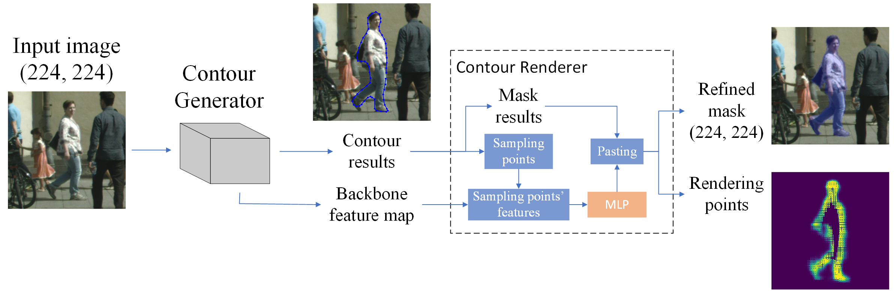
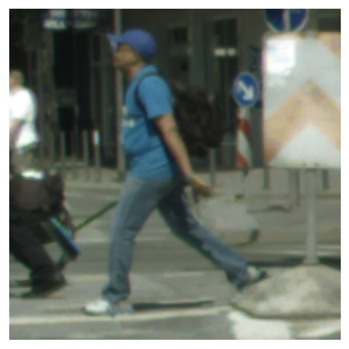
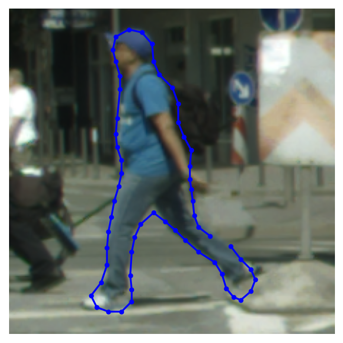
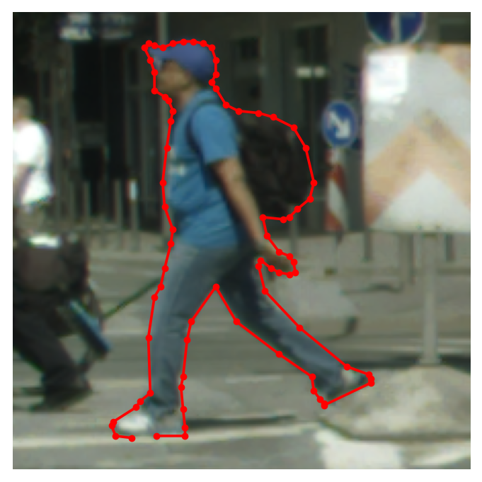
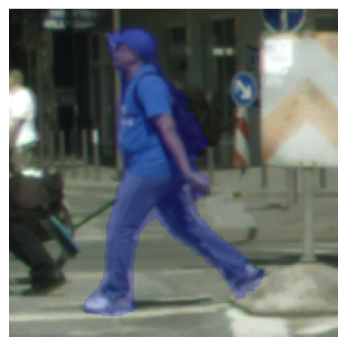
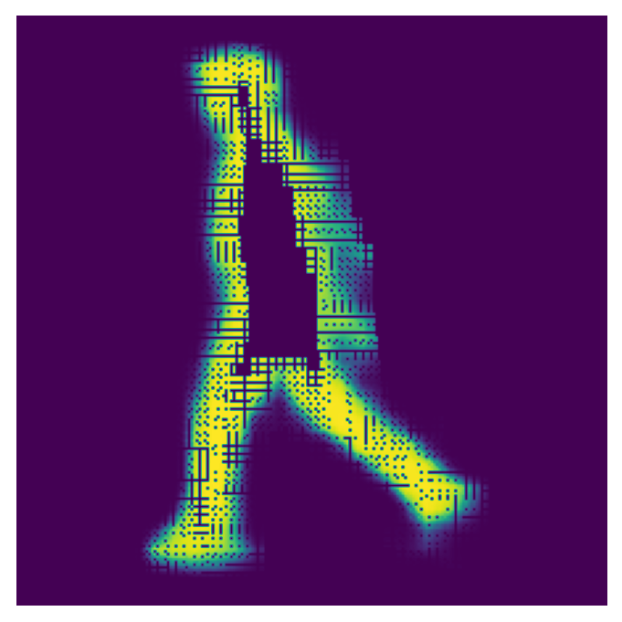

# ContourRend

> ContourRend: A Segmentation Method for Improving Contours by Rendering ([paper](https://arxiv.org/abs/2007.07437))



- The contour generator is based on Tian's model ([paper](https://aapm.onlinelibrary.wiley.com/doi/epdf/10.1002/mp.14327))

## Test result on Cityscapes

<table>
    <tr>
        <td></td>
        <td></td>
        <td></td>
        <td></td>
        <td></td>
        <td></td>
    </tr>
</table>

## Train

### dataset

> Process refers to Curve-GCN's [dataloader](https://github.com/fidler-lab/curve-gcn/tree/dataloader)

### config

configs/config.json

- `data_root`: annotation files (train, train_val, val)

```bash
python train_extend.py
```

## Test

- latest pretrained model ([download](https://drive.google.com/file/d/14CeLMy-a2oxoEfLpFjIhzzbc4UD3z14k/view?usp=sharing))

|         Model         |  Bicycle  |    Bus    |  Person   |   Train   |   Truck   | Motorcycle |    Car    |   Rider   |   mIoU    |
| :-------------------: | :-------: | :-------: | :-------: | :-------: | :-------: | :--------: | :-------: | :-------: | :-------: |
| Polygon-GCN + DiffAcc | **66.55** | **85.01** |   72.94   |   60.99   |   79.78   |   63.87    |   81.09   |   71.00   |   72.66   |
|      ContourRend      |   66.23   |   80.94   | **74.32** | **63.04** | **79.92** | **65.04**  | **81.26** | **72.70** | **72.93** |

```bash
python test_extend.py --gpus 0,1,2,3 --ckpt weight/latest.pth
```

